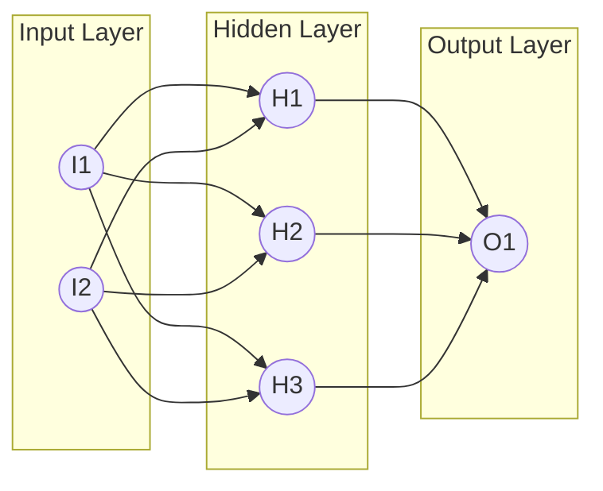

Project Title: DigitWhiz
📄 Description:
DigitWhiz is a lightweight web API for handwritten digit recognition using the MNIST dataset. It features a trained neural network served via FastAPI, allowing users to send digit images and receive real-time predictions. This project is perfect for demonstrating how deep learning models can be deployed as production-ready services. It also introduces best practices in API design, model packaging, and prediction handling.

🧠 Neural Network Architecture (Mermaid)
Here's a basic feedforward neural network for MNIST (e.g., input → hidden layers → output):

## code Credit:
This code is adepted from [neural-networks-and-deep-learning](https://github.com/unexploredtest/neural-networks-and-deep-learning/)